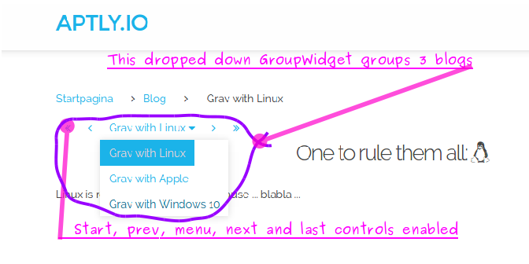

# [Grav GroupWidget Plugin][project]

This plugin builds a navigation widget that conveniently groups content together based on the taxonomy configuration.


## About

`GroupWidget` is a plugin for [**Grav**](http://getgrav.org).
This readme describes version 0.1.0.
The plugin gathers the links of all the content that matches with a taxonomy filter in the current page's header.
It creates a configurable HTML widget that lets one nagivate to the first, previous, next, last content.
Or a drop down menu that jumps directly into a specific content.
The widget layout is done with a partial twig template.
The included CSS styling fits well with the antimatter theme.

Your reasons for grouping content might be:
* A 7-day adventurous holiday diary where a blog per day gives access to the other descriptions.
* A sports blogger might group his point of view on a per club basis.
* A foodie who groups all the dessert experiments together.
* ...

This screen shot gives you an idea how this might look like:

<a name="screenshot">

</a>


## Issues

Please open a new [issue][issues] for defects or new functionality.


## Installation and Updates

There's a manual install and update method by downloading
[this plugin](https://github.com/aptly-io/grav-plugin-groupwidget)
and extracting all plugin files to `</your/site>/grav/user/plugins/groupwidget`.

Alternatively, Grav has a
[command line tool, bin/gpm](http://learn.getgrav.org/advanced/grav-gpm)
to manage this plugin's life-cycle.


## Usage

The plugin comes with a sensible and self explanatory default
[plugin configuration (`groupwidget.yaml`)](groupwidget.yaml),
a [layout (`templates/partials/groupwidget.html.twig`)](templates/partials/groupwidget.html.twig)
and a [styling (`assets/css/groupwidget.css`)](assets/css/groupwidget.css) for antimatter.


### Integrate the plugin's twig template into the theme

The partial twig needs integration into the theme.
A quick and dirty solution is to include this inside antimatter's `item.html.twig` template
(the template used for rendering a single blog content; see the added line 21):

```diff
                <div class="blog-content-item grid pure-g-r">
                    <div id="item" class="block pure-u-2-3">
+                           
                            
                    </div>
                <div id="sidebar" class="block size-1-3 pure-u-1-3">
```

A cleaner way might be to tweak the `blog_item.html.twig` partial template.
Depending on whether it's part of a list view or not,
replace the rendering of the title with the whole navigation widget.

```diff
                 <a href="{{ page.header.link }}">{{ page.title }}</a>
             </h2>
         
-            <h2><a href="{{ page.url }}">{{ page.title }}</a></h2>
+            
+                <h2><a href="{{ page.url }}">{{ page.title }}</a></h2>
+            
+                
+            
         

         
```

### Group content with the GroupWidget's configuration header

To group different content pages, add a GroupWidget header configuration to each content.
Grav's build-in
[taxonomy](http://learn.getgrav.org/content/taxonomy) with
[filtering](http://learn.getgrav.org/content/headers#collection-by-taxonomy) and
[ordering](http://learn.getgrav.org/content/headers#ordering-options)
is leveraged to group and sort the content.

Here's an extended configuration example:

```yaml

taxonomy:
    group: shiraz
    category: blog
    tag: [wine]

groupwidget:
    built_in_css: true                                # use the build in style
    controls: [ first, last, prev, next, label, menu] # enable all the widget's controls
    number: 0010                                      # controls sorting order
    filters:
        group: shiraz                                 # groups content on the wine grape type Shiraz
    order:
        by: header.groupwidget.number                 # sort on the groupwidget.number header configuration value
        dir: desc                                     # descending ordering (as opposed to asc)
```

For using this filter, one needs to add `group` to the `user/config/site.yaml`'s `taxonomy`.
All the content grouped under the `shiraz` banner, now needs a `group: shiraz` in their `taxonomy` header configuration.

The [screenshot](screenshot) above was generated using these _bogus_ content samples:

``` markdown
---
title: Grav with Windows 10
date: 19680916

taxonomy:
    group: grav_dev

groupwidget:
    filters:
        group: grav_dev
    order:
        by: date
---

# 
## Eternal rebooting with Microsoft <i class="fa fa-windows"></i>

All suits fling to Microsoft because ... blabla ...
```

and

```markdown
---
title: Grav with Apple
date: 20150115

taxonomy:
    group: grav_dev

groupwidget:
    filters:
        group: grav_dev
    order:
        by: date
---

# 
## Apple <i class="fa fa-apple"></i> plunders our wallets

Fashionistas show off with Apple because ... blabla ...
```


## License

Copyright 2015 Francis Meyvis.

[Licensed](LICENSE) for use under the terms of the [MIT license][mit-license].


[project]: https://github.com/aptly-io/grav-plugin-groupwidget
[issues]: https://github.com/aptly-io/grav-plugin-groupwidget/issues "GitHub Issues for Grav GroupWidget Plugin"
[mit-license]: http://www.opensource.org/licenses/mit-license.php "MIT license"
